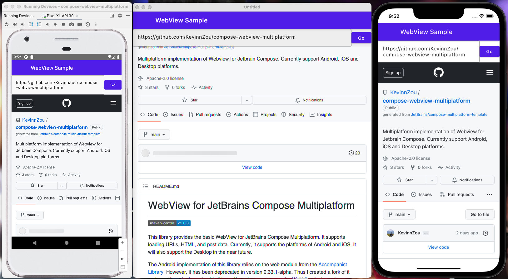

# WebView for JetBrains Compose Multiplatform

[](https://search.maven.org/artifact/io.github.kevinnzou/compose-webview-multiplatform)
[](http://kotlinlang.org)
[](https://github.com/JetBrains/compose-multiplatform)




### 🚨 Seeking Desktop Maintainer 🚨

Unfortunately, our current desktop platform maintainer, @DATL4G, cannot continue his role due to
other commitments. We are now looking for a new team member who can take over the desktop side of
the library, handling development, issue resolution, and feature enhancements. If you're a desktop
developer ready to dive into open-source, we want you!

**Contact:** zoumingjie17@163.com


> **Note**
> This library is built using
>
the [compose multiplatform library template](https://github.com/KevinnZou/compose-multiplatform-library-template).
> It supports automatic package publishing, documentation, and code style checking.

This library can be considered as the Multiplatform version
of [Compose WebView library](https://github.com/KevinnZou/compose-webview).
It provides the basic WebView functionalities for JetBrains Compose Multiplatform, which supports
loading URLs, HTML, and post data. Currently, it supports the platforms of Android, iOS, and
Desktop.

* The Android implementation of this library relies on the web module from
  the [Accompanist Library](https://github.com/google/accompanist/tree/main/web).
    - **Note:** it has been deprecated in version 0.33.1-alpha. Thus I created a fork of it and used
      it as the base for this library. If you just want to use the WebView in Jetpack Compose,
      please visit this repo: https://github.com/KevinnZou/compose-webview.

* The iOS implementation of this library relies
  on [WKWebView](https://developer.apple.com/documentation/webkit/wkwebview).

* The Desktop implementation of this library relies
  on [JavaFX WebView](https://docs.oracle.com/javase/8/javafx/api/javafx/scene/web/WebView.html) for
  version <= 1.2.0.
    - Thanks to @DATL4G, starting from version 1.3.0, we switched
      to [Java CEF Browser](https://github.com/chromiumembedded/java-cef) for better performance.
    - starting from version 1.7.0, we switched from Java CEF Browser
      to [Kotlin CEF Browser](https://github.com/DatL4g/KCEF/tree/master) for more features and
      better performance.
    - **Note:** After switching to KCEF, developers need to configure it for the desktop app. Please
      see
      the [README.desktop.md](https://github.com/KevinnZou/compose-webview-multiplatform/blob/main/README.desktop.md)
      for more details.

For more information, visit the
documentation: https://kevinnzou.github.io/compose-webview-multiplatform/

## Basic Usage

**Note:** Developers targeting the _Desktop_ platform should refer
to [README.desktop.md](https://github.com/KevinnZou/compose-webview-multiplatform/blob/main/README.desktop.md)
for setup instructions first.

To use this widget, two key APIs are needed: *WebView*, which provides the layout, and
*rememberWebViewState(url)* which provides some remembered state including the URL to display.

The basic usage is as follows:

```kotlin
val state = rememberWebViewState("https://example.com")

WebView(state)
```

This will display a WebView in your Compose layout that shows the URL provided.

## WebView State

This library provides a *WebViewState* class as a state holder to hold the state for the WebView.

```kotlin
class WebViewState(webContent: WebContent) {
    var lastLoadedUrl: String? by mutableStateOf(null)
        internal set

    /**
     *  The content being loaded by the WebView
     */
    var content: WebContent by mutableStateOf(webContent)

    /**
     * Whether the WebView is currently [LoadingState.Loading] data in its main frame (along with
     * progress) or the data loading has [LoadingState.Finished]. See [LoadingState]
     */
    var loadingState: LoadingState by mutableStateOf(LoadingState.Initializing)
        internal set

    /**
     * Whether the webview is currently loading data in its main frame
     */
    val isLoading: Boolean
        get() = loadingState !is LoadingState.Finished

    /**
     * The title received from the loaded content of the current page
     */
    var pageTitle: String? by mutableStateOf(null)
        internal set

    /**
     * A list for errors captured in the last load. Reset when a new page is loaded.
     * Errors could be from any resource (iframe, image, etc.), not just for the main page.
     * To filter for only main frame errors, use [WebViewError.isFromMainFrame].
     */
    val errorsForCurrentRequest: SnapshotStateList<WebViewError> = mutableStateListOf()

    /**
     * Custom Settings for WebView.
     */
    val webSettings: WebSettings by mutableStateOf(WebSettings())

    // We need access to this in the state saver. An internal DisposableEffect or AndroidView
    // onDestroy is called after the state saver and so can't be used.
    internal var webView by mutableStateOf<IWebView?>(null)
}
```

It can be created using the *rememberWebViewState* function, which can be remembered across
Compositions.

```kotlin
val state = rememberWebViewState("https://github.com/KevinnZou/compose-webview-multiplatform")

/**
 * Creates a WebView state that is remembered across Compositions.
 *
 * @param url The url to load in the WebView
 * @param additionalHttpHeaders Optional, additional HTTP headers that are passed to [WebView.loadUrl].
 *                              Note that these headers are used for all subsequent requests of the WebView.
 */
@Composable
fun rememberWebViewState(
    url: String,
    additionalHttpHeaders: Map<String, String> = emptyMap()
)

/**
 * Creates a WebView state that is remembered across Compositions.
 *
 * @param data The uri to load in the WebView
 * @param baseUrl The URL to use as the page's base URL.
 * @param encoding The encoding of the data in the string.
 * @param mimeType The MIME type of the data in the string.
 * @param historyUrl The history URL for the loaded HTML. Leave null to use about:blank.
 */
@Composable
fun rememberWebViewStateWithHTMLData(
    data: String,
    baseUrl: String? = null,
    encoding: String = "utf-8",
    mimeType: String? = null,
    historyUrl: String? = null
)

/**
 * Creates a WebView state that is remembered across Compositions.
 *
 * @param fileName The file to load in the WebView
 */
@Composable
fun rememberWebViewStateWithHTMLFile(
    fileName: String,
)
```

Developers can use the *WebViewState* to get the loading information of the WebView, such as the
loading progress, the loading status, and the URL of the current page.

```kotlin
Column {
    val state = rememberWebViewState("https://github.com/KevinnZou/compose-webview-multiplatform")

    Text(text = "${state.pageTitle}")
    val loadingState = state.loadingState
    if (loadingState is LoadingState.Loading) {
        LinearProgressIndicator(
            progress = loadingState.progress,
            modifier = Modifier.fillMaxWidth()
        )
    }
    WebView(
        state
    )
}
```

## WebView Navigator

This library provides a *WebViewNavigator* class to control over the navigation of a WebView from
outside the composable. E.g.for performing a back navigation in response to the user clicking the "
up" button in a TopAppBar.
It can be used to load a new URL, evaluate the JavaScript, and go back and forward in the history.

```kotlin
class WebViewNavigator(private val coroutineScope: CoroutineScope) {

    /**
     * True when the web view is able to navigate backwards, false otherwise.
     */
    var canGoBack: Boolean by mutableStateOf(false)
        internal set

    /**
     * True when the web view is able to navigate forwards, false otherwise.
     */
    var canGoForward: Boolean by mutableStateOf(false)
        internal set

    fun loadUrl(url: String, additionalHttpHeaders: Map<String, String> = emptyMap()) {}

    fun loadHtml(
        html: String,
        baseUrl: String? = null,
        mimeType: String? = null,
        encoding: String? = "utf-8",
        historyUrl: String? = null
    ) {
    }

    fun postUrl(
        url: String,
        postData: ByteArray
    ) {
    }

    fun evaluateJavaScript(script: String, callback: ((String) -> Unit)? = null)

    /**
     * Navigates the webview back to the previous page.
     */
    fun navigateBack() {}

    /**
     * Navigates the webview forward after going back from a page.
     */
    fun navigateForward() {}

    /**
     * Reloads the current page in the webview.
     */
    fun reload() {}

    /**
     * Stops the current page load (if one is loading).
     */
    fun stopLoading() {}
}
```

It can be created using the *rememberWebViewNavigator* function, which can be remembered across
Compositions.

```kotlin
val navigator = rememberWebViewNavigator()

@Composable
fun rememberWebViewNavigator(
    coroutineScope: CoroutineScope = rememberCoroutineScope()
): WebViewNavigator = remember(coroutineScope) { WebViewNavigator(coroutineScope) }
```

Developers can use the *WebViewNavigator* to control the navigation of the WebView.

```kotlin
val navigator = rememberWebViewNavigator()

Column {
    val state = rememberWebViewState("https://example.com")
    val navigator = rememberWebViewNavigator()

    TopAppBar(
        title = { Text(text = "WebView Sample") },
        navigationIcon = {
            if (navigator.canGoBack) {
                IconButton(onClick = { navigator.navigateBack() }) {
                    Icon(
                        imageVector = Icons.Default.ArrowBack,
                        contentDescription = "Back"
                    )
                }
            }
        }
    )
    Text(text = "${state.pageTitle}")
    val loadingState = state.loadingState
    if (loadingState is LoadingState.Loading) {
        LinearProgressIndicator(
            progress = loadingState.progress,
            modifier = Modifier.fillMaxWidth()
        )
    }
    WebView(
        state = state,
        navigator = navigator
    )
}
```

## Communication between WebView and Native

Starting from version 1.8.0, this library provides a `WebViewJsBridge` to allow developers to
communicate between the WebView and Native.
Developers can use the JsBridge to register a handler to handle the message from the WebView.

```kotlin
val jsBridge = rememberWebViewJsBridge()

LaunchedEffect(jsBridge) {
    jsBridge.register(GreetJsMessageHandler())
}
```

The handler should implement the `IJsMessageHandler` interface.

```kotlin
interface IJsMessageHandler {
    fun methodName(): String

    fun canHandle(methodName: String) = methodName() == methodName

    fun handle(
        message: JsMessage,
        callback: (String) -> Unit,
    )

}

class GreetJsMessageHandler : IJsMessageHandler {
    override fun methodName(): String {
        return "Greet"
    }

    override fun handle(message: JsMessage, callback: (String) -> Unit) {
        Logger.i {
            "Greet Handler Get Message: $message"
        }
        val param = processParams<GreetModel>(message)
        val data = GreetModel("KMM Received ${param.message}")
        callback(dataToJsonString(data))
    }
}
```

Developers can use the `window.kmpJsBridge.callNative` to send a message to the Native.
It receives three parameters:

* methodName: the name of the handler registered in the Native.
* params: the parameters to send to the Native. It needs to be a JSON string.
* callback: the callback function to handle the response from the Native. It receives a JSON string
  as the parameter. Pass null if no callback is needed.

```javascript
window.kmpJsBridge.callNative = function (methodName, params, callback) {
    ...
}
```

Here is an example:

```javascript
window.kmpJsBridge.callNative("Greet",JSON.stringify({message:"Hello"}),
  function (data) {
    document.getElementById("subtitle").innerText = data;
    console.log("Greet from Native: " + data);
  }
);
```

**Note:** Starting from version 1.8.6, the name of the JsBridge is configurable. Developers can
configure it in the `rememberWebViewJsBridge` method.
This library uses the `kmpJsBridge` as the default.

## Request Interceptor

Starting from version 1.9.8, this library provides a `RequestInterceptor` to allow developers to
intercept the request and modify the request headers. It only supports the Android and iOS platform
for now.

```kotlin
/**
 * Interface for intercepting requests in WebView.
 */
interface RequestInterceptor {
    fun onInterceptUrlRequest(
        request: WebRequest,
        navigator: WebViewNavigator,
    ): WebRequestInterceptResult
}
```

The `onInterceptUrlRequest` method will be called when the WebView sends a request.

Developers can implement the `RequestInterceptor` interface to define their own interceptor.
Then they can pass it to the `rememberWebViewNavigator` method to intercept the request.

```kotlin
val navigator =
    rememberWebViewNavigator(
        requestInterceptor =
        object : RequestInterceptor {
            override fun onInterceptUrlRequest(
                request: WebRequest,
                navigator: WebViewNavigator,
            ): WebRequestInterceptResult {
                return if (request.url.contains("kotlin")) {
                    WebRequestInterceptResult.Modify(
                        WebRequest(
                            url = "https://kotlinlang.org/docs/multiplatform.html",
                            headers = mutableMapOf("info" to "test"),
                        ),
                    )
                } else {
                    WebRequestInterceptResult.Allow
                }
            }
        },
    )
```

## WebSettings

Starting from version 1.3.0, this library allows users to customize web settings.
Some common web settings can be shared across different platforms, such as
isJavaScriptEnabled and userAgent.

```kotlin
class WebSettings {
    var isJavaScriptEnabled = true

    var customUserAgentString: String? = null

    /**
     * Android platform specific settings
     */
    val androidWebSettings = PlatformWebSettings.AndroidWebSettings()

    /**
     * Desktop platform specific settings
     */
    val desktopWebSettings = PlatformWebSettings.DesktopWebSettings()

    /**
     * iOS platform specific settings
     */
    val iOSWebSettings = PlatformWebSettings.IOSWebSettings

}
```

For platform-specific settings, this library provides the PlatformWebSettings.
These settings will only be applied to the respective platforms and will not affect other platforms.

```kotlin
sealed class PlatformWebSettings {
    data class AndroidWebSettings(
        /**
         * whether the WebView should support zooming using its on-screen zoom
         * controls and gestures. The particular zoom mechanisms that should be used
         * can be set with {@link #setBuiltInZoomControls}. This setting does not
         * affect zooming performed using the {@link WebView#zoomIn()} and
         * {@link WebView#zoomOut()} methods. The default is {@code true}.
         *
         * @param support whether the WebView should support zoom
         */
        var supportZoom: Boolean = true,

        /**
         * whether Safe Browsing is enabled. Safe Browsing allows WebView to
         * protect against malware and phishing attacks by verifying the links.
         */
        var safeBrowsingEnabled: Boolean = true,

        // .....
    ) : PlatformWebSettings()

    data class DesktopWebSettings(
        var offScreenRendering: Boolean = false,
        var transparent: Boolean = false,
    ) : PlatformWebSettings()

    data object IOSWebSettings : PlatformWebSettings()
}
```

Developers can configure custom settings in the shared code in the following way:

```kotlin
val webViewState = rememberWebViewStateWithHTMLData(
    data = html
)
DisposableEffect(Unit) {
    webViewState.webSettings.apply {
        isJavaScriptEnabled = true
        androidWebSettings.apply {
            isAlgorithmicDarkeningAllowed = true
            safeBrowsingEnabled = true
        }
    }
    onDispose { }
}
```

## HTML

This library supports loading HTML data and HTML files.

### HTML Data

Developers can load HTML data in the following way:

```kotlin
val html = """
    <html>
        <body>
            <h1>Hello World</h1>
        </body>
    </html>
""".trimIndent()
val webViewState = rememberWebViewStateWithHTMLData(
    data = html
)
```

### HTML File

Developers can load HTML files in the following way:

```kotlin
val webViewState = rememberWebViewStateWithHTMLFile(
    fileName = "index.html"
)
```

Note that the HTML file should be put in the `resources/assets` folder of the shared module.

It also supports external resources such as images, CSS, and JavaScript files on Android and iOS.
Desktop support is coming soon.

## Handling permission requests on Android

There are 4 types of permissions that can be requested by the WebView on Android:

- RESOURCE_PROTECTED_MEDIA_ID
- RESOURCE_MIDI_SYSEX
- RESOURCE_AUDIO_CAPTURE
- RESOURCE_VIDEO_CAPTURE

`RESOURCE_PROTECTED_MEDIA_ID` and `RESOURCE_MIDI_SYSEX` are special ones, because they don't have a
native Android counterpart, so it's not possible to request a permission from the user to grant
them transitively. Therefore, you configure the WebView to grant these permissions automatically,
by setting the respective properties under `AndroidWebSettings` to true:

```kotlin
webViewState.webSettings.apply {
    // ...
    androidWebSettings.apply {
        // Grants RESOURCE_PROTECTED_MEDIA_ID permission, default false
        allowProtectedMedia = true
        // Grants RESOURCE_MIDI_SYSEX permission, default false
        allowMidiSysexMessages = true
    }
    // ...
}
```

`RESOURCE_AUDIO_CAPTURE` and `RESOURCE_VIDEO_CAPTURE` are also handled internally by the WebView,
but you need to make sure to explicitly ask for these permissions in your app. If user grants them,
the WebView will be able to use them without any additional configuration.

## API

The complete API of this library is as follows:

```kotlin
/**
 *
 * A wrapper around the Android View WebView to provide a basic WebView composable.
 *
 * @param state The webview state holder where the Uri to load is defined.
 * @param modifier A compose modifier
 * @param captureBackPresses Set to true to have this Composable capture back presses and navigate
 * the WebView back.
 * @param navigator An optional navigator object that can be used to control the WebView's
 * navigation from outside the composable.
 * @param onCreated Called when the WebView is first created.
 * @param onDispose Called when the WebView is destroyed.
 * @param factory A function that creates a platform-specific WebView object.
 * @sample sample.BasicWebViewSample
 */
@Composable
fun WebView(
    state: WebViewState,
    modifier: Modifier = Modifier,
    captureBackPresses: Boolean = true,
    navigator: WebViewNavigator = rememberWebViewNavigator(),
    webViewJsBridge: WebViewJsBridge? = null,
    onCreated: (NativeWebView) -> Unit = {},
    onDispose: (NativeWebView) -> Unit = {},
    factory: ((WebViewFactoryParam) -> NativeWebView)? = null,
)
```

## Example

A simple example would be like this:

```kotlin
@Composable
internal fun WebViewSample() {
    MaterialTheme {
        val webViewState =
            rememberWebViewState("https://github.com/KevinnZou/compose-webview-multiplatform")
        Column(Modifier.fillMaxSize()) {
            val text = webViewState.let {
                "${it.pageTitle ?: ""} ${it.loadingState} ${it.lastLoadedUrl ?: ""}"
            }
            Text(text)
            WebView(
                state = webViewState,
                modifier = Modifier.fillMaxSize()
            )
        }

    }
}
```

For a full example, please refer
to [BasicWebViewSample](https://github.com/KevinnZou/compose-webview-multiplatform/blob/main/sample/shared/src/commonMain/kotlin/com/kevinnzou/sample/BasicWebViewSample.kt)

## Download

[](https://search.maven.org/artifact/io.github.kevinnzou/compose-webview-multiplatform)

You can add this library to your project using Gradle.

### Multiplatform

To add to a multiplatform project, add the dependency to the common source-set:

```kotlin
repositories {
    mavenCentral()
    // Desktop target has to add this repo
    maven("https://jogamp.org/deployment/maven")
}

kotlin {
    sourceSets {
        commonMain {
            dependencies {
                // use api since the desktop app need to access the Cef to initialize it.
                api("io.github.kevinnzou:compose-webview-multiplatform:1.9.40")
            }
        }
    }
}
```

### Single Platform

For an Android-only project, you directly can use
my [another library](https://github.com/KevinnZou/compose-webview).
Add the dependency to app-level `build.gradle.kts`:

```kotlin
repositories {
    mavenCentral()
}

dependencies {
    implementation("io.github.KevinnZou:compose-webview:0.33.3")
}
```

# Publications

The following is a list of articles/blog posts that have been published discussing this plugin:

1. [Web Everywhere: Introducing our Compose Multiplatform WebView Library](https://medium.com/@kevinnzou/web-everywhere-introducing-our-multiplatform-compose-webview-library-f9b1264b370)
2. [What’s new in Compose Multiplatform WebView 1.5.0：Migrated to CEF Browser & Cookie Management Supported](https://medium.com/@kevinnzou/whats-new-in-compose-multiplatform-webview-1-5-0-migrated-ff2b3c564981)
3. [Loading Local HTML files in Compose Multiplatform WebView](https://medium.com/@kevinnzou/loading-local-html-files-in-compose-multiplatform-webview-9a842f1ab9d9)
4. [Bridging the Gap: Empowering JS and Native Communication in Compose Multiplatform WebView Library Version 1.8.0](https://medium.com/@kevinnzou/bridging-the-gap-empowering-js-and-native-communication-in-version-1-8-0-d17ce4d601b7)
